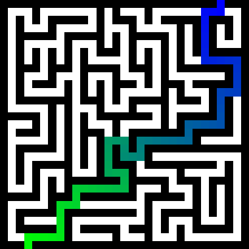

## Maze Solver

	Creates and solves mazes of NxN cells with a start and a goal.
    The start cell must be located in the first row of the maze.
    The goal cell must be located in the last row of the maze.
    For a graphic maze:
        * the first row must have only one empty cell, which will be the start cell. 
        * the last row must have only one empty cell, which will be the goal cell. 

	version: 0.0.4
	author: Joan A. Pinol
	author_nickname: japinol
	author_gitHub: japinol7
	author_twitter: @japinol

## Usage

	mazesolver [-h] [-c] [-i] [-n NAME] [-nr ROWS] [-nc COLUMNS] [-p] [-s SOLVER] [-t]

	optional arguments:
	  -h, --help            show this help message and exit
      -c,           --create
	                        create a new maze instead of loading one.
      -i,           --image
	                        load and save a graphic maze instead of a text one.
      -n,           --name
	                        the maze's name (without extension). Ex: maze_01 
                            This name plus and extension will be the file to load or to create.
                            All files will be loaded from the input folder and saved into the output folder
                            All text mazes must have this extension: .txt
                            All graphic mazes must have this extension: .png
      -p,           --print
	                        print the maze created or load and the maze solution to the console.
      -nr,          --rows
	                        the number of rows. Must be between 4 and 2000.
      -nc,          --columns
	                        the number of columns. Must be between 4 and 2000.
      -s,           --solver
	                        solver algorithm. Available solvers: astar, bfs, dfs
      -st,          --savetext
	                        save maze as text in addition to save it as image even if asked for an image maze
	  -t,           --debugtraces
	                        show debug back traces information when something goes wrong

**Default optional arguments**

	create 	            False
	columns             12
	debugtraces         False
	image 	            False
	name 	            maze_01
	print 	            False
	rows                32
	savetext 	        False
	solver 	            bfs

**Cells legend**

	S           Start
	G           Goal
	W           Wall
	·           Empty cell
	*           Path cell found between S and G

**Example of a text maze and its solution.**

    W  W  ·  ·  W  S  W  W  W  W  W  W  W  W  W                 W  W  ·  ·  W  S  W  W  W  W  W  W  W  W  W
    W  ·  ·  ·  ·  ·  ·  ·  ·  ·  ·  ·  ·  ·  W                 W  ·  *  *  *  *  ·  ·  ·  ·  ·  ·  ·  ·  W
    W  W  ·  W  W  W  W  W  W  W  W  W  W  W  W                 W  W  *  W  W  W  W  W  W  W  W  W  W  W  W
    W  ·  ·  ·  ·  ·  ·  ·  ·  ·  ·  ·  W  ·  W                 W  ·  *  *  *  *  *  *  *  *  *  *  W  ·  W
    W  W  W  W  W  W  W  W  W  W  W  ·  ·  ·  W                 W  W  W  W  W  W  W  W  W  W  W  *  ·  ·  W
    W  ·  ·  ·  ·  ·  ·  ·  ·  ·  ·  ·  W  ·  W                 W  ·  ·  *  *  *  *  *  *  *  *  *  W  ·  W
    W  ·  W  ·  W  W  W  W  W  W  W  W  W  ·  W                 W  ·  W  *  W  W  W  W  W  W  W  W  W  ·  W
    W  ·  W  ·  ·  ·  ·  ·  W  ·  ·  ·  ·  ·  W                 W  ·  W  *  *  *  *  *  W  ·  ·  ·  ·  ·  W
    W  W  W  ·  W  W  W  ·  W  W  W  ·  W  ·  W                 W  W  W  ·  W  W  W  *  W  W  W  ·  W  ·  W
    W  ·  ·  ·  W  ·  ·  ·  W  ·  W  ·  W  ·  W                 W  ·  ·  ·  W  ·  ·  *  W  ·  W  ·  W  ·  W
    W  ·  W  ·  W  ·  W  ·  W  ·  W  ·  W  ·  W                 W  ·  W  ·  W  ·  W  *  W  ·  W  ·  W  ·  W
    W  ·  W  ·  W  ·  W  ·  W  ·  W  W  W  W  W                 W  ·  W  ·  W  ·  W  *  W  ·  W  W  W  W  W
    W  ·  W  ·  ·  ·  W  ·  W  ·  W  W  ·  ·  W                 W  ·  W  ·  ·  ·  W  *  W  ·  W  W  ·  ·  W
    W  ·  ·  ·  W  ·  W  ·  ·  ·  ·  ·  ·  ·  W                 W  ·  ·  ·  W  ·  W  *  *  *  *  *  *  ·  W
    W  ·  W  W  W  W  W  W  W  W  W  W  G  W  W                 W  ·  W  W  W  W  W  W  W  W  W  W  G  W  W

**Example of an image maze and its solution.**

       
  

**Mazes in the input folder.**

The example mazes in the input folder were generated either by hand, or using 
the software [Daedalus](http://www.astrolog.org/labyrnth/daedalus.htm)

Kinds of mazes:
* Perfect: Perfect mazes have only one solution.
* Braid:   Braid mazes have multiple solutions.

**More info on solver algorithms.**

* astar >> A* search >>
            [Wikipedia A* search](https://en.wikipedia.org/wiki/A*_search_algorithm)

* bfs >>    breadth-first search >>
            [Wikipedia Breadth-first search](https://en.wikipedia.org/wiki/Breadth-first_search)

* dfs >>    depth-first search >>
            [Wikipedia Depth-first search](https://en.wikipedia.org/wiki/Depth-first_search)

**Examples of usage**

    $ python -m mazesolver
    $ python -m mazesolver --image --name maze_braid_31 --solver bfs
    $ python -m mazesolver --create --name maze_02 --rows 50 --columns 40 --solver astar

**To make The Maze Solver work**

	Do this:
	    1. Clone this repository in your local system.
	    2. Go to its folder in your system.
	    3. $ pip install -r requirements.txt
	    4. $ python -m mazesolver
